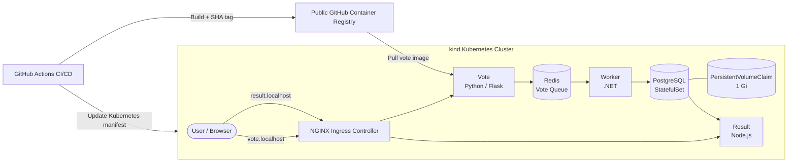

# SquareOps DevOps Intern Take-Home Assignment

This repository contains my solution for the SquareOps DevOps Intern take-home assignment. It improves the Docker Example Voting App by deploying all five application components on a local Kubernetes cluster with persistent PostgreSQL storage, Kubernetes Secrets, health probes, resource constraints, NGINX Ingress, a one-command bootstrap process, and an automated GitHub Actions CI/CD pipeline for the vote service.

## Overview

The application consists of five components:

- **Vote** — Python/Flask frontend where users cast votes.
- **Redis** — In-memory queue that temporarily stores incoming votes.
- **Worker** — .NET background worker that consumes votes from Redis and writes them to PostgreSQL.
- **PostgreSQL** — Persistent database deployed as a Kubernetes StatefulSet.
- **Result** — Node.js frontend that displays voting results.

The complete application runs locally on a Kubernetes cluster created with `kind`.

## Architecture



### Application data flow

1. The user opens the **Vote** frontend through NGINX Ingress.
2. A vote is submitted and stored temporarily in **Redis**.
3. The **Worker** consumes the vote from Redis.
4. The Worker writes the vote to **PostgreSQL**.
5. The **Result** frontend reads from PostgreSQL and displays the updated results.
6. PostgreSQL data is stored on a PersistentVolumeClaim so that data survives database pod recreation.

## Improvements Implemented

### PostgreSQL StatefulSet and persistent storage

PostgreSQL was converted from a Kubernetes `Deployment` using `emptyDir` storage to a `StatefulSet` backed by a `PersistentVolumeClaim`.

The PVC requests:

```yaml
resources:
  requests:
    storage: 1Gi
```

Persistence was verified by:

1. Casting a vote.
2. Deleting the `db-0` PostgreSQL pod.
3. Waiting for the StatefulSet to recreate the pod.
4. Verifying that the previously cast vote was still available.

This proves that PostgreSQL data survives pod recreation.

> Deleting the entire `kind` cluster also deletes its locally provisioned storage. Persistence in this assignment is demonstrated across pod recreation, not complete cluster destruction.

### Kubernetes Secret

PostgreSQL credentials are stored in:

```text
k8s-specifications/db-secret.yaml
```

The PostgreSQL StatefulSet loads `POSTGRES_USER` and `POSTGRES_PASSWORD` using `secretKeyRef` instead of hard-coding credentials directly in the workload manifest.

### Health probes

Every workload includes both readiness and liveness probes:

| Workload | Probe strategy |
| --- | --- |
| Vote | HTTP GET `/` |
| Result | HTTP GET `/` |
| Redis | `redis-cli ping` |
| PostgreSQL | `pg_isready` |
| Worker | Lightweight process-liveness check |

The Worker uses a lightweight `/proc/1` process check because the minimal container image does not contain utilities such as `pgrep` or `ps` and does not expose an HTTP health endpoint. In a production environment, an application-level health endpoint would provide stronger health verification.

### Resource requests and limits

Every workload defines CPU and memory requests and limits to improve scheduling predictability and prevent uncontrolled resource consumption.

### NGINX Ingress

The Vote and Result frontends are exposed through the NGINX Ingress Controller instead of NodePort services.

Host-based routing is used:

```text
vote.localhost   -> vote service
result.localhost -> result service
```

Both frontend services use `ClusterIP` and are accessed externally through the Ingress Controller.

## Prerequisites

Install the following before running the project:

- Docker
- `kubectl`
- `kind`
- Git
- A Linux environment or WSL 2 on Windows

Verify the required tools:

```bash
docker --version
kubectl version --client
kind version
git --version
```

Docker must be running before executing the bootstrap script.

## Quick Start

Clone the repository:

```bash
git clone https://github.com/AnshRajvanshi/squareops-devops-assignment.git
cd squareops-devops-assignment
```

Run the one-command bootstrap:

```bash
./bootstrap.sh
```

The script automatically:

1. Verifies that Docker, `kind`, and `kubectl` are available.
2. Verifies that Docker is running.
3. Creates a `kind` cluster named `squareops` if one does not already exist.
4. Switches to the correct Kubernetes context.
5. Installs the NGINX Ingress Controller.
6. Waits for the Ingress Controller to become ready.
7. Deploys all Kubernetes manifests.
8. Waits for PostgreSQL and all application Deployments to become ready.
9. Displays pod status and application access instructions.

The bootstrap script is idempotent and can reuse an existing `squareops` cluster.

## Access the Application

After the bootstrap process completes, run:

```bash
kubectl port-forward --address 0.0.0.0 \
  -n ingress-nginx service/ingress-nginx-controller 8090:80
```

Keep this terminal open.

Then access:

```text
Vote:   http://vote.localhost:8090
Result: http://result.localhost:8090
```

The complete data path is:

```text
Browser
  -> NGINX Ingress
  -> Vote
  -> Redis
  -> Worker
  -> PostgreSQL
  -> Result
  -> Browser
```

## Verify the Deployment

Check all application pods:

```bash
kubectl get pods
```

Expected workloads:

```text
db-0       1/1   Running
redis-*    1/1   Running
result-*   1/1   Running
vote-*     1/1   Running
worker-*   1/1   Running
```

Check the Ingress:

```bash
kubectl get ingress
```

Check services:

```bash
kubectl get services
```

The `vote` and `result` services should be `ClusterIP`, not `NodePort`.

## Verify PostgreSQL Persistence

Cast a vote through:

```text
http://vote.localhost:8090
```

Verify it appears at:

```text
http://result.localhost:8090
```

Then delete the PostgreSQL pod:

```bash
kubectl delete pod db-0
```

The StatefulSet automatically recreates it. Wait until it becomes ready:

```bash
kubectl get pods -w
```

Refresh the result page. The previous vote should still be available because the recreated PostgreSQL pod reattaches to the existing PersistentVolumeClaim.

Verify the PVC:

```bash
kubectl get pvc
```

## CI/CD Pipeline

The GitHub Actions workflow is located at:

```text
.github/workflows/vote-ci-cd.yaml
```

It automatically triggers only when files under:

```text
vote/**
```

are modified on the `main` branch.

The pipeline performs the following steps:

1. Checks out the repository.
2. Authenticates to GitHub Container Registry.
3. Builds the Vote service Docker image.
4. Tags the image with the exact Git commit SHA.
5. Pushes the image to the public GitHub Container Registry.
6. Updates `k8s-specifications/vote-deployment.yaml` with the new immutable image tag.
7. Commits the updated manifest back to the repository.

Example image:

```text
ghcr.io/anshrajvanshi/squareops-devops-assignment/vote:<commit-sha>
```

Using the exact Git SHA provides traceability between source code, container image, and Kubernetes deployment.

The automated manifest commit does not create an infinite CI/CD loop because the workflow trigger watches only `vote/**`, while the automated commit modifies only the Kubernetes manifest.

## Repository Structure

```text
.
├── .github/
│   └── workflows/
│       └── vote-ci-cd.yaml
├── k8s-specifications/
│   ├── db-secret.yaml
│   ├── db-service.yaml
│   ├── db-statefulset.yaml
│   ├── ingress.yaml
│   ├── redis-deployment.yaml
│   ├── redis-service.yaml
│   ├── result-deployment.yaml
│   ├── result-service.yaml
│   ├── vote-deployment.yaml
│   ├── vote-service.yaml
│   └── worker-deployment.yaml
├── vote/
├── result/
├── worker/
├── bootstrap.sh
├── docker-compose.yml
├── README.md
└── README-ORIGINAL.md
```

## Useful Commands

View application pods:

```bash
kubectl get pods
```

View services:

```bash
kubectl get services
```

View Ingress:

```bash
kubectl get ingress
```

View persistent storage:

```bash
kubectl get pvc
```

View application logs:

```bash
kubectl logs deployment/vote
kubectl logs deployment/result
kubectl logs deployment/redis
kubectl logs deployment/worker
kubectl logs db-0
```

Describe a pod for troubleshooting:

```bash
kubectl describe pod <pod-name>
```

Check rollout status:

```bash
kubectl rollout status deployment/vote
kubectl rollout status deployment/result
kubectl rollout status deployment/redis
kubectl rollout status deployment/worker
kubectl rollout status statefulset/db
```
## Troubleshooting

### 1. Pods do not come up

First, check the status of all application pods:

```bash
kubectl get pods
```

If a pod is stuck in `Pending`, `CrashLoopBackOff`, `ImagePullBackOff`, or another unhealthy state, inspect it:

```bash
kubectl describe pod <pod-name>
```

Check the container logs:

```bash
kubectl logs <pod-name>
```

For a container that has restarted, inspect the previous container logs:

```bash
kubectl logs <pod-name> --previous
```

Also verify rollout status:

```bash
kubectl rollout status deployment/vote --timeout=180s
kubectl rollout status deployment/result --timeout=180s
kubectl rollout status deployment/redis --timeout=180s
kubectl rollout status deployment/worker --timeout=180s
kubectl rollout status statefulset/db --timeout=180s
```

Common causes include image pull failures, failed health probes, insufficient resources, or a dependency such as Redis or PostgreSQL not being ready.

### 2. A vote does not reach the Result app

The voting flow is:

```text
Vote → Redis → Worker → PostgreSQL → Result
```

Check each component in sequence:

```bash
kubectl get pods
kubectl logs deployment/vote
kubectl logs deployment/worker
kubectl logs deployment/result
```

Verify that Redis and PostgreSQL services exist:

```bash
kubectl get services
```

Test Redis connectivity from inside the Redis pod:

```bash
kubectl exec deployment/redis -- redis-cli ping
```

Expected output:

```text
PONG
```

Check the Worker logs for successful connections to Redis and PostgreSQL:

```bash
kubectl logs deployment/worker
```

If necessary, restart the Worker after confirming its dependencies are healthy:

```bash
kubectl rollout restart deployment/worker
kubectl rollout status deployment/worker --timeout=180s
```

### 3. Ingress URLs do not open in the browser

Verify that the NGINX Ingress Controller is running:

```bash
kubectl get pods -n ingress-nginx
```

Verify the Ingress resource:

```bash
kubectl get ingress
```

Start the required port-forward and keep that terminal open:

```bash
kubectl port-forward --address 0.0.0.0 \
  -n ingress-nginx service/ingress-nginx-controller 8090:80
```

Then open:

```text
http://vote.localhost:8090
http://result.localhost:8090
```

If the browser still cannot connect, test the routing directly:

```bash
curl -I -H "Host: vote.localhost" http://localhost:8090
curl -I -H "Host: result.localhost" http://localhost:8090
```

Both endpoints should return `HTTP/1.1 200 OK`.

If port `8090` is already in use, identify the conflicting process or use another local port:

```bash
kubectl port-forward --address 0.0.0.0 \
  -n ingress-nginx service/ingress-nginx-controller 8091:80
```

Then access the applications on port `8091`.
## Clean Up

Delete the complete local Kubernetes cluster:

```bash
kind delete cluster --name squareops
```

This also deletes cluster-local PersistentVolumes and stored voting data.

To recreate everything:

```bash
./bootstrap.sh
```

## Validation Performed

The following scenarios were manually tested:

- Original application running through Docker Compose.
- All five workloads running on Kubernetes.
- End-to-end voting flow through Redis, Worker, PostgreSQL, and Result.
- PostgreSQL persistence across `db-0` pod deletion and recreation.
- Readiness and liveness probes on all five workloads.
- Resource requests and limits on all five workloads.
- NGINX Ingress routing for both frontends.
- Browser access through `vote.localhost` and `result.localhost`.
- CI/CD trigger on changes under `vote/**`.
- Vote service source code linted with Flake8 in CI.
- Kubernetes manifests validated with kubeconform in strict mode.
- Fresh `kind` cluster created inside the GitHub Actions runner for every CI/CD test run.
- Complete application deployed to the fresh CI cluster and the Vote endpoint smoke-tested for HTTP 200 OK.
- SHA-tagged image pushed to public GHCR.
- Automated Kubernetes manifest update by GitHub Actions.
- CI-built public image successfully pulled and run by Kubernetes.
- Complete cluster deletion followed by successful one-command recreation using `./bootstrap.sh`.

## Trade-offs and Production Considerations

This solution is intentionally optimized for a local `kind`-based take-home environment.

For a production deployment, I would additionally consider:

- Using an external secret manager rather than storing Kubernetes Secret manifests in Git.
- Encrypting secrets at rest.
- Using managed PostgreSQL or a production-grade database operator.
- Adding TLS termination and real DNS.
- Implementing an application-level health endpoint for the Worker.
- Adding NetworkPolicies.
- Adding Horizontal Pod Autoscaling where appropriate.
- Using GitOps tooling such as Argo CD or Flux for deployment reconciliation.
- Adding automated security scanning and Kubernetes manifest validation to CI.
- Using managed persistent storage with backups and disaster recovery.

## Author

**Ansh Rajvanshi**

B.Tech in Computer Science and Engineering
National Institute of Technology Karnataka, Surathkal
